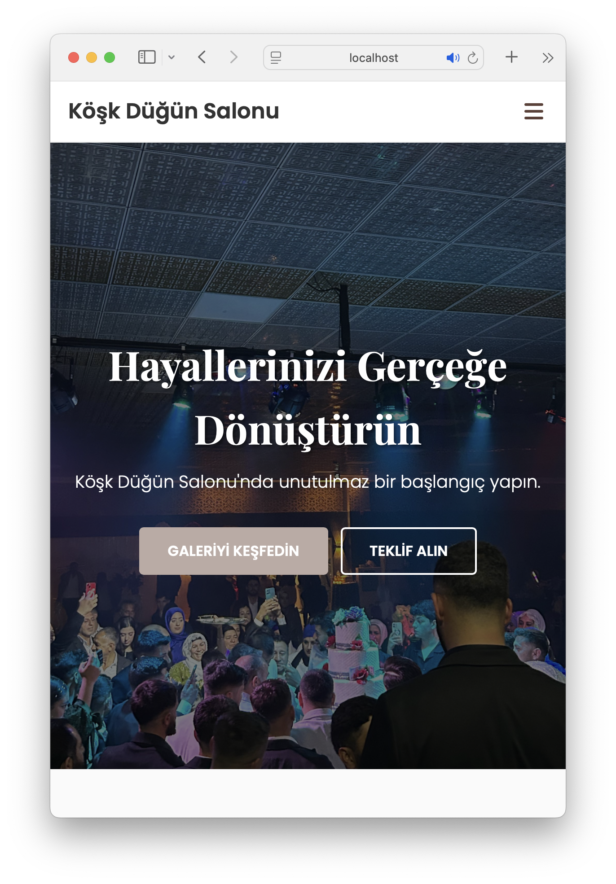

# 💍 Köşk Düğün Salonu - Web Sitesi Projesi

Bu proje, bir düğün salonu için sıfırdan geliştirilmiş, modern ve tam duyarlı (fully responsive) bir web sitesidir. Yazılım mühendisliği öğrencisi olarak, front-end ve back-end teknolojilerini bir arada kullanarak dinamik bir web uygulaması geliştirme becerilerini sergilemek amacıyla oluşturulmuştur.

Sitenin canlı demosuna buradan ulaşabilirsiniz: **[Canlı Demo Linki - HENÜZ YOK]**

## 🖼️ Ekran Görüntüleri

Projenin genel görünümünü yansıtan ekran görüntüleri:

**Masaüstü Görünümü**

**Mobil Görünümü**

---

## ✨ Temel Özellikler

- **Tam Duyarlı Tasarım:** Tüm cihazlarla (mobil, tablet, masaüstü) uyumlu, akıcı bir kullanıcı deneyimi sunar.
- **Modern Arayüz:** Kullanıcı dostu ve estetik bir tasarıma sahiptir.
- **Dinamik Sayfalar:** Ana Sayfa, Hakkımızda, Galeri, Hizmetlerimiz ve İletişim gibi temel kurumsal sayfa yapılarını içerir.
- **İnteraktif Elementler:**
    - JavaScript ile oluşturulmuş, şık açılır-kapanır mobil menü (Hamburger Menü).
    - Sayfa kaydırıldıkça beliren zarif animasyonlar (Scroll Reveal efekti).
    - Tıklandığında resimleri büyüten interaktif galeri (Lightbox).
- **PHP Destekli İletişim Formu:** Kullanıcıların doldurduğu teklif formlarını, belirtilen e-posta adresine güvenli bir şekilde gönderir.

---

## 🛠️ Kullanılan Teknolojiler

Bu proje, aşağıdaki teknolojiler kullanılarak geliştirilmiştir:

---

